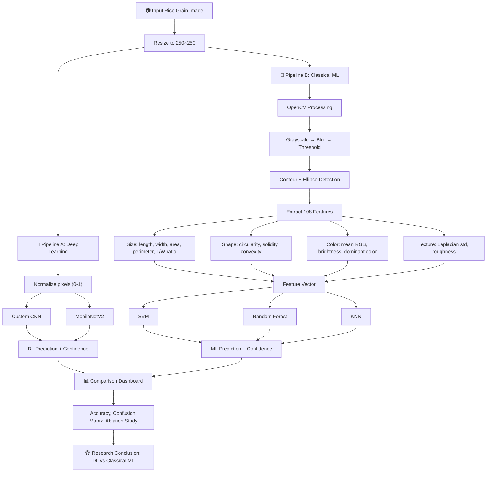

# Rice Grain Classifier — Final Project Architecture

## The Big Picture

This project is **not** about picking one best model. The project **IS** the comparison itself.

Your final deliverable is a system that:
1. Takes a rice grain image
2. Runs it through **two parallel pipelines** (Deep Learning vs Classical ML)
3. Shows **both results side-by-side**
4. Compares which approach works better (and why)

That comparison — with accuracy numbers, confusion matrices, and the ablation study — is what makes this a research project, not just an app.

---

## The Two Pipelines

### Pipeline A — Deep Learning (Image → Prediction)

```
Raw Image (250×250 pixels)
    ↓
  Resize / Normalize (0-1 range)
    ↓
  ┌─────────────────────────────────────────┐
  │  Model 1: Custom CNN                    │
  │  3 conv blocks → flatten → dense → 5    │
  │  Trained from scratch on our dataset    │
  │  Target: ~95% accuracy                  │
  └─────────────────────────────────────────┘
  ┌─────────────────────────────────────────┐
  │  Model 2: MobileNetV2 (Transfer Learn)  │
  │  Frozen ImageNet base → our classifier  │
  │  Fine-tuned on our dataset              │
  │  Target: ~99% accuracy                  │
  └─────────────────────────────────────────┘
    ↓
  Prediction: "Basmati" (confidence: 97.3%)
```

**What these models see:** Raw pixels. They learn their own features automatically (edges, textures, shapes) through training. They do NOT use our OpenCV pipeline at all.

**Role:** Show what modern deep learning can do with just images — no manual feature engineering needed.

---

### Pipeline B — Classical ML (Image → OpenCV Features → Prediction)

```
Raw Image (250×250 pixels)
    ↓
  OpenCV Pipeline (what we built in the demo)
    ↓
  ┌─────────────────────────────────────────┐
  │  Feature Extraction                     │
  │  SIZE:    length, width, area, L/W...   │
  │  SHAPE:   circularity, solidity...      │
  │  COLOR:   mean RGB, brightness...       │
  │  TEXTURE: Laplacian std dev...          │
  │                                         │
  │  Total: ~108 numerical features         │
  └─────────────────────────────────────────┘
    ↓
  ┌───────────┐  ┌───────────┐  ┌───────────┐
  │  SVM      │  │  Random   │  │  KNN      │
  │  (RBF     │  │  Forest   │  │  (K=5)    │
  │  kernel)  │  │  (100+    │  │           │
  │           │  │  trees)   │  │           │
  └───────────┘  └───────────┘  └───────────┘
    ↓                ↓               ↓
  Predictions from each model
```

**What these models see:** Numbers only. They never see the image. They receive a row of 108 values like `[length=142.3, width=45.1, lw_ratio=3.15, area=4820, ...]` and predict from that.

**Role:** Show the traditional approach — humans design the features (size/shape/color/texture), then let simple models classify from those numbers.

---

## Complete System Flowchart



---

## What Each Component Does

| Component | Input | Output | Purpose in the project |
|-----------|-------|--------|----------------------|
| **OpenCV Pipeline** | Raw image | Visual steps + 108 numbers | Feature extraction for Classical ML; also used for the demo visualization |
| **Custom CNN** | Raw pixels (250×250×3) | 5-class prediction | Baseline deep learning — shows what a simple CNN achieves |
| **MobileNetV2** | Raw pixels (224×224×3) | 5-class prediction | State-of-the-art transfer learning — shows the upper bound |
| **SVM** | 108 features | 5-class prediction | Classical ML with clear decision boundaries |
| **Random Forest** | 108 features | 5-class prediction | Classical ML with feature importance rankings |
| **KNN** | 108 features | 5-class prediction | Simplest classical approach — distance-based |
| **Ablation Study** | Subsets of 108 features | Accuracy per subset | Shows which of the 4 parameters (size/shape/color/texture) matter most |
| **Comparison Dashboard** | All model results | Side-by-side metrics | The actual research output |

---

## The Demo App (What We're Building Now)

The Streamlit app serves as the **front-end** for all of this:

```
┌──────────────────────────────────────────────────────┐
│  DEMO APP (Streamlit)                                │
│                                                      │
│  1. Upload / select image                            │
│  2. Show OpenCV pipeline steps (visual)              │
│  3. Show extracted measurements (size/shape/color/   │
│     texture)                                         │
│  4. Run ALL models on the same image                 │
│  5. Show results side-by-side:                       │
│     ┌─────────────┐  ┌──────────────┐               │
│     │ Deep Learn.  │  │ Classical ML │               │
│     │ CNN: Basmati │  │ SVM: Basmati │               │
│     │ MNV2: Basmat │  │ RF:  Basmati │               │
│     │              │  │ KNN: Jasmine │               │
│     └─────────────┘  └──────────────┘               │
│  6. Show comparison metrics (accuracy, confusion     │
│     matrices, ablation study results)                │
└──────────────────────────────────────────────────────┘
```

---

## Current Status vs Final

| Part | Current (prototype) | Final version |
|------|-------------------|---------------|
| OpenCV pipeline + feature extraction | ✅ Working | ✅ Same (already real) |
| Texture extraction | ✅ Working | ✅ Same |
| Classification | ❌ Fake rule-based scoring | ✅ Trained ML/DL models |
| CNN model | ❌ Not built yet | Needs training on dataset |
| MobileNetV2 model | ❌ Not built yet | Needs training on dataset |
| SVM / RF / KNN | ❌ Not built yet | Needs training on extracted features |
| Ablation study | ❌ Empty table | Needs running all feature subsets |
| Comparison dashboard | ❌ Not built yet | Shows all model results |

---

## Training Order (Recommended)

1. **Classical ML first** (SVM, RF, KNN) — fastest to train, uses features we already extract
2. **Custom CNN** — takes longer but straightforward
3. **MobileNetV2** — transfer learning, likely highest accuracy
4. **Ablation study** — run Classical ML with each feature subset
5. **Wire everything into the demo app** — replace the fake scoring with real model predictions
